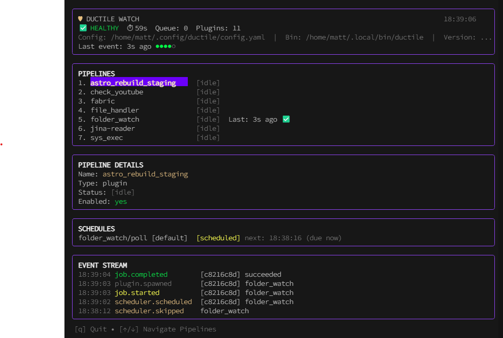

# Ductile

[](https://golang.org)
[](https://opensource.org/licenses/MIT)

**The Glue for Your Homelab Automation.**

Ductile is a lightweight, polyglot integration engine that turns simple scripts into reliable, event-driven pipelines. It fills the gap between fragile cron jobs and heavy-duty automation platforms (n8n, Node-RED).

A single Go binary orchestrates connectors written in any language via a simple JSON protocol. No cluster, no managed services, no ops overhead—just your logic, unified.

---

## Grokking Ductile in 30 Seconds

Ductile works by connecting **Connectors** (plugins) via **Pipelines** using an internal **Event Bus**.

```text
[ Trigger ] --(event)--> [ Pipeline ] --(step 1)--> [ Connector A ]
                                      --(step 2)--> [ Connector B ]
                                      --(step 3)--> [ Connector C ]
```

1.  **Connectors** do the work (fetch a URL, run a shell command, send a Discord message).
2.  **Schedules** or **Webhooks** trigger the first event.
3.  **Pipelines** react to events and chain connectors together, passing data (the "payload") between them.
4.  **The Queue** ensures every step is retried on failure and tracked in real-time.

---

## Core Capabilities

-   **Polyglot Runtime** — Write connectors in Python, Bash, Node.js, Go, or Rust. If it reads `stdin` and writes `stdout` JSON, it works.
-   **Event-Driven Pipelines** — Chain connectors into multi-step workflows. Pass data downstream with automatic metadata (baggage) propagation.
-   **Smart Scheduling** — Support for `cron`, fuzzy intervals, and jitter to avoid thundering herds.
-   **Secure Webhooks** — Inbound HMAC-verified endpoints for GitHub, Discord, or custom services.
-   **Parallel Dispatch** — Bounded worker pool with per-plugin concurrency caps and "concurrency-safe" manifest hints.
-   **Plugin Aliasing** — Run multiple instances of the same connector (e.g., three different Discord notifications) without duplicating code.
-   **Resilient Queue** — SQLite-backed, at-least-once delivery. Automatically recovers and retries orphaned jobs after a system crash.
-   **TUI "Overwatch"** — A beautiful terminal dashboard to monitor every job, retry, and event in real-time.
-   **LLM-First Discovery** — Built-in `/skills` registry and auto-generated OpenAPI specs for seamless AI agent operation.
-   **Local & Private** — Zero-ops, single-binary architecture. Your data, your keys, your hardware.

---

## What Can You Build?

### 1. The "YouTube Wisdom" Pipeline
Automatically fetch, transcribe, and AI-summarize new videos from a playlist, then save them to your blog and notify Discord.

```yaml
# Define the workflow in pipelines.yaml
pipelines:
  - name: playlist-to-knowledge-base
    on: youtube.playlist_item
    steps:
      - uses: youtube_transcript   # Fetches raw transcript
      - uses: fabric               # AI-summarizes via LLM (Fabric)
      - uses: file_handler         # Saves markdown to your repo
      - uses: discord_notify       # Pings you when it's done
```

### 2. The "Repo Sentinel"
Monitor your GitHub repositories for new PRs, run a custom policy check (e.g., license or format), and notify your team of violations.

```yaml
pipelines:
  - name: github-policy-guard
    on: github.webhook.pull_request
    steps:
      - uses: repo_policy          # Custom script checking for README/License
      - uses: discord_notify       # Alert if policy fails
        if: payload.policy_failed == true
```

### 3. The "Astro Staging Rebuild"
Watch a local folder for new markdown files (e.g., from an AI summary pipeline) and trigger a site rebuild only when changes are detected.

```yaml
plugins:
  folder_watch:
    schedules:
      - every: 1m
    config:
      root: "./content/summaries"
      event_type: summaries.updated

pipelines:
  - name: rebuild-on-update
    on: summaries.updated
    steps:
      - uses: sys_exec
        config:
          command: "npm run build && docker restart astro-site"
```

---

## Quick Start

```bash
# 1. Build the binary
go build -o ductile ./cmd/ductile

# 2. Start the gateway (uses ./config by default)
./ductile system start

# 3. Launch the TUI (in another terminal) to watch the magic
./ductile system watch
```



## Documentation

-   [**Getting Started**](docs/GETTING_STARTED.md) — From zero to your first pipeline.
-   [**Cookbook**](docs/COOKBOOK.md) — Real-world recipes (Discord, YouTube, Astro, etc.).
-   [**10 Idioms of Ductile**](docs/10_IDIOMS_OF_DUCTILE.md) — How to think in Ductile.
-   [**Core Architecture**](docs/ARCHITECTURE.md) — The technical deep dive.
-   [**Database Reference**](docs/DATABASE.md) — Schemas and useful SQL queries.
-   [**Plugin Development**](docs/PLUGIN_DEVELOPMENT.md) — Build your own connectors.

---

## License
MIT. See [LICENSE](LICENSE) for details.

## Changelog
See [CHANGELOG.md](CHANGELOG.md).
